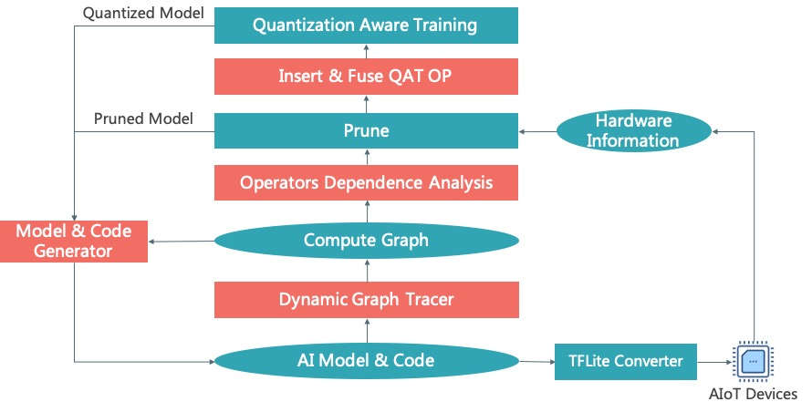

# TinyNeuralNetwork
[English](README.md)

TinyNeuralNetwork是一个高效、易用的深度学习模型压缩框架。它包含模型结构搜索、剪枝、量化、模型转换等功能， 能将巨大的深度学习模型压缩数倍到数十倍，目前在天猫精灵、海尔电视、优酷视频、人脸打卡机等场景中完成了落地，为超千万的IoT设备提供了AI能力。

## 安装

python >= 3.6, pytorch >= 1.4（如果使用量化训练 pytorch >= 1.6 ）

```shell
# 安装TinyNeuralNetwork软件包
git clone https://github.com/alibaba/TinyNeuralNetwork.git
cd TinyNeuralNetwork
python setup.py install

# 或者使用一行命令进行安装
pip install git+https://github.com/alibaba/TinyNeuralNetwork.git
```

## 贡献

我们的项目欢迎你的贡献，关于更多的细节，可参见[此处](CONTRIBUTING_zh-CN.md)。

## 基本模块

+ 计算图捕获：通过Graph Tracer捕获PyTorch算子连接关系，并基于此实现自动的剪枝、模型量化， 并支持将PyTorch模型逆向codegen为等价的model.py.
+ 依赖分析：修改单个算子往往会导致多个相关算子的改变，我们将其称为一个子图。通过Graph Modifier 可以自动处理子图内部、子图之间的依赖关系，从而实现自动化的计算图修改.
+ Pruner：实现了自动化的OneShot（L1、L2、FPGM），ADMM，NetAdapt，Gradual，End2End等剪枝算法， 会逐步对外开源.
+ 量化训练：TinyNeuralNetwork使用PyTorch的QAT作为后端（我们扩展了BF16训练），并优化了其易用性，可自动完成算子的融合及计算图的量化 （官方实现中需要用户手动实现，工作量巨大）.
+ 模型转换：TinyNeuralNetwork支持将浮点及量化的PyTorch模型转换为TFLite，以实现模型的端上部署.
  

## 代码架构

+ [examples](examples) ：提供了各个功能的示例
+ [models](models) ：提供了部分预训练的模型，以供快速实验
+ [tests](tests) ：单元测试
+ [tinynn](tinynn) ：模型压缩代码
    + [graph](tinynn/graph)
      ：计算图捕获、分析、量化，代码生成，掩码管理等基础设施
    + [prune](tinynn/prune) ：剪枝算法
    + [converter](tinynn/converter) ：模型转换
    + [util](tinynn/util) ：工具类

## RoadMap
+ 2021.11：自适应剪枝率
+ 2021.12：Transformer压缩

## 引用

如果你的研究中使用了TinyNeuralNetwork，可以考虑引用本项目。

```
@misc{tinynn,
    title={TinyNeuralNetwork: An efficient deep learning model compression framework},
    author={Ding, Huanghao and Pu, Jiachen and Hu, Conggang},
    howpublished = {\url{https://github.com/alibaba/TinyNeuralNetwork}},
    year={2021}
}
```

## 常见问题

由于PyTorch具有极高的编码自由度，我们无法确保所有的Case都能自动化覆盖，当你遇到问题时，
可以查看[《常见问题解答》](docs/FAQ_zh-CN.md) ， 或者加入钉钉答疑群


