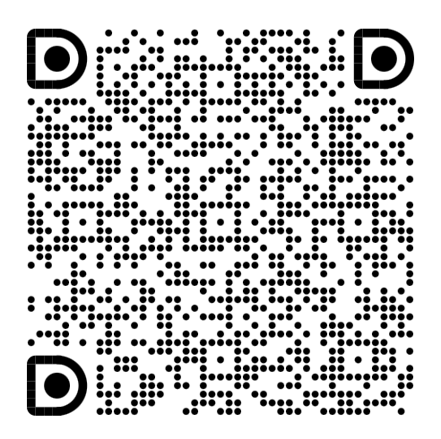

# ADMM pruning sample
[简体中文](README_zh-CN.md)

ADMM is a model pruning algorithm mentioned in the paper [A Systematic DNN Weight Pruning Framework using Alternating Direction Method of Multipliers](https://arxiv.org/abs/1804.03294).

## ADMM pruning configuration
The parameters are listed as follows.

<dl>
<dt><tt>sparsity</tt>: float</dt>
<dd>Sparsity: all prunable operators remove channels with this ratio </dd>
<dt><tt>metrics</tt>: str</dt>
<dd>Evaluation method used for channel pruning, valid values include (l1_norm, l2_norm, fpgm, random) </dd>
<dt><tt>admm_iterations</tt>: int</dt>
<dd>Number of ADMM training iterations, i.e. the number of the total training rounds divided by the value of <tt>admm_epoch</tt> </dd>
<dt><tt>admm_epoch</tt>: int</dt>
<dd>ADMM update cycle of Z and U </dd>
<dt><tt>rho</tt>: float</dt>
<dd>Penalty parameters for the training process </dd>
<dt><tt>admm_lr</tt>: float</dt>
<dd>Learning rate of the ADMM training process </dd>
</dl>

## ADMM pruning code description
The flow of the code is described as follows.
1. Parse the configuration file.
2. Generate the `ADMMPruner` object from the configuration file.
3. Generate a configuration file with pruning rates for each layer inplace. You can modify the pruning rates for specific operators. (optional)
4. Generate a `DLContext` object with parameters for ADMM sparse training.
5. Call the `pruner.prune()` method to prune the provided model (The data and the dimensions of the weight tensor and other related tensors of the operators will be updated, thus you will get a smaller model.)
6. Generate a `DLContext` object with parameters for finetuning.
7. Perform finetuning on the pruned model.

## How do I adapt it to my model and code?
As for the dataset, you can see that the code comes with the utility functions for the cifar10 dataset. We also provide processing functions for datasets like cifar100 and imagenet (in the `tinynn.util` namespace). If you need to train with other datasets, you may need to write your own functions referring to our implementation.

As for the process, the training and validation functions need to be replaced by yours and the rest just remains.

As for the model, you just need to replace the model built by ADMMPruner object in step 2.

## Frequently Asked Questions

Because of the high complexity and frequent updates of PyTorch, we cannot ensure that all cases are covered through automated testing. When you encounter problems
You can check out the [FAQ](../../../docs/FAQ.md), or join the Q&A group in DingTalk via the QR Code below.

